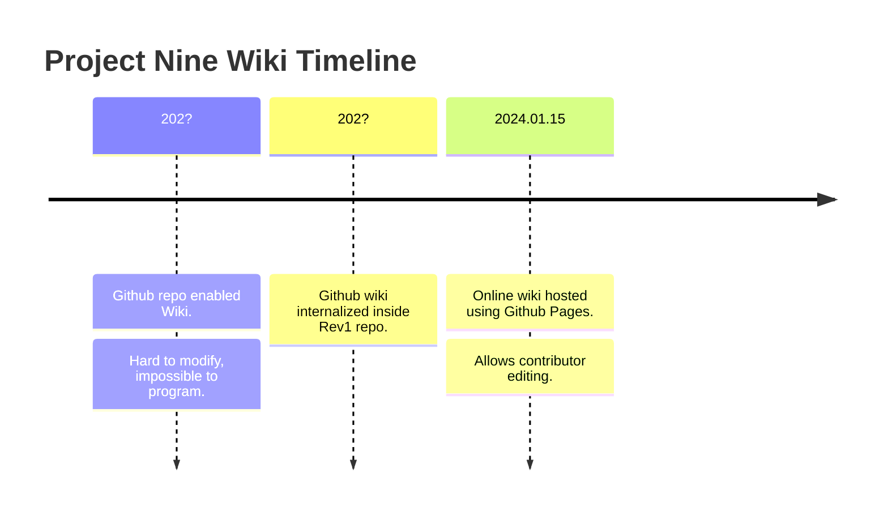

# Project Nine Wiki (WIP)

<!-- 
The Project Nine Wiki is dedicated to Project Nine in-world entities, and NOT *about* project nine or per *meta-project-nine* - aka. those things "about" project nine are considered management sort of notes.
If something exists in our world (aka. on earth, and in-world), consider don't record it here in Wiki (record as Legends of NFC catalog instead) unless it's really siginificant.  

Specifically, those are the things that DO NOT go in this wiki:  

1. Descriptions of canonical novels, because those are (usually) NOT in-world entities.

On the other hand, we could have a seperate folder `Meta` which denote things not-in-world, thus making this wiki complete, and comprehensible about Project Nine.

For quick ideas that are not developed, use Legends of NFC: useful for names, relationships, foods, etc.

In the future this wiki is subject based, instead of physically (or geographically) based. And we are diminishing the role of categorization in favour of self-contained contents.
The only potentially programmable feature is tags. Otherwise this wiki is not programmed.
We don't need any images or videos - just text notes are good enough. All images should generally go to ~~either DigiKam or~~ Digital Assets (including P9 specific reference images).
-->

<blockquote>WARNING: Potential spoiler alert! Contents in this wiki cover objects, people and locations that otherwise play significant roles in stories of Project Nine. If you do not with to spoil the mysteries when reading novels, avoid contents that are tagged with <code>@Spoiler Alert</code> or marked with ⚠️ symbol.</blockquote>

Welcome to Project Nine's wiki and community hub!

This is the official wiki for Project Nine. 
For technical issues, go to [Issues](https://github.com/Charles-Zhang-Project-Nine/ProjectNineWiki/issues).  
For general topic discussion, go to [Discussion Forum](https://github.com/Charles-Zhang-Project-Nine/ProjectNineWiki/discussions)  
If you are a contributor, consult [Guidelines](https://wiki.nine.totalimagine.com/assets/blog/posts/2024/01/15/Project-Nine-Wiki-Community-Guidelines.html).  
HTML, PDF and text version of the novels will be made available online when they are done.

Top-level navigational Table of Contents (sidebar) is a work-in-progress.
For now, go directly to either [English Version](./en) or [中文版本](./中文).

