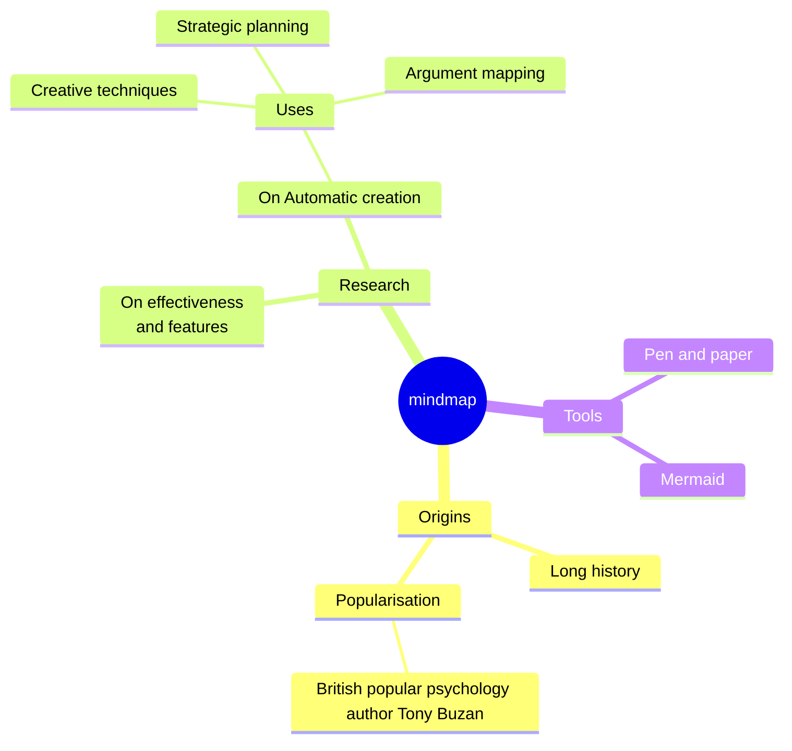

<!-- Main Header -->
Temporary Functionality Test of Wiki

## Overview

Original Draft: 2023-01-15  
Publication: N/A  

This is a development-time test and shall be hidden from the view of the general public. This file tests the functionalities of the wiki. It's an adaption of https://www.totalimagine.com/Resources/CoolMarkdown.html, and tests various aspects of the wiki functions.

## Tests

### Basic Formatting

1. Text formatting: **bold**, *italic*, ***bold italic***, and ~~strikethrough~~.
5. LaTeX formulas: $E=mc^2$.

<!-- Table -->

|Markdown|Word Doc|Text|
|-|-|-|
|Light weight|Binary|Light Weight|
|Plain Text + HTML, CSS, SVG|XML and Indecipherable|Plain Text|

<!-- Chart -->

