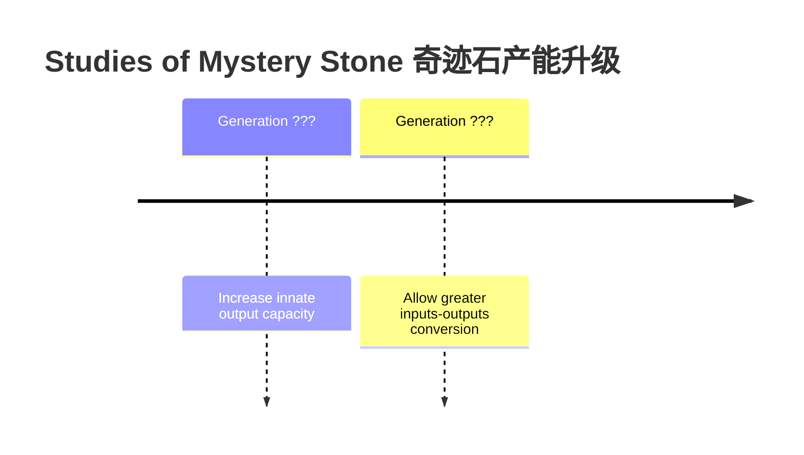

# Portkey 星刻 -> Hyupeda (Hipda)

Tags: Legendary Object, Medalian World, Fepulans

At the very beginning the creators left now-called "portkey" as a shrine - a direct gateway to access the innerworld (potentially with some restrictions). By inputting increasingly bigger amount of energy and change modes of interaction, one can achieve different visuals with it.

Later when Ora Busa Lica the first queen successfully entered the Inner World and came out, she changed the form of it, making a much more accessible interface and increased the energy barrier to accessing it. the The vast amount of ordinary people should generally NOT be able to use Portkey to any useful extent - but only examine it with the power-interface (the brute force method by injecting external powers and operate through the interface Kun I left). 

* (Design, #Balance) Maybe as a star chart it can only show other planets and locations as a map and can only show detailed information of the source planet - in other words, Medalian Queen cannot access more advanced information on Tellus directly from this. As such it's questionable whether Medalian Queen can remotely access information on the surface of Tellus at all! Also it might pose restrictions on the power of Medalian Queen on Tellus - could it be that the powers granted by the Portkey are only applicable on the confinement of the Doma system, or even only Ids?
* (Design) Traditionally, in different cultures, across generations and history (and across the various alien civilizations - since PortKeys are NOT unique to Medalians), this particular object is called by many different names.

The Hyupeda has quite a few major applications or main functionalities, each one of those can be activated at a time, and is of critical strategical significance:

1. Infinite power source
2. Innerspace (A region between Innerworld and Outerworld)
3. The Many Worlds
4. Universe Map/定星盘
5. Truth Machine
6. Navigator: The Hyupeda is immensely helpful in interstellar navigation (and likely can't do it without) in fiding usable black-holes and 翘曲空间 jumping points and thus greatly reduce travel distance.

Based on above applications, there are traditional Medalian applicants/toys built based on/replicating those functions: 1) (Toy)星刻挂坠、(Serious)星际罗盘, 2) (Toy)真理机、(Serious)预言机。Those two are possible to replicate because manufacturers only need to bake in informatoin obtained from Hyupeda, or mimic the quantum mechanical nature of it.

## Naming and Etymology

* Portkey (in Travel Mode)
* 星刻 (in Map Mode)
* "heatstone": heat (hyu) + stone (peda) = hyu2pe2da1 修派达 or hipda (in Power Mode)
* Truth Machine 真理机 (in Query Mode)

## Food Source

When their ancestors first came to this world (Ids), they are lost. It's harsh environment and strange habitat. The creator(s) granted them a device that allows them to fullfill their wishes of basic needs: abundant food and water for the entire species, despite the harsh environment of local habitat. So Portkey is sacred.

The medalian culture didn't have algriculture at the very early times of their civilization (except the rural areas) because of plenty of food/energy supply from The Portkey - they could just gather and hunter and still ahve plenty of time to study Mysteries (奇迹研究学).

美达拉文明截止至今已经进行了2780次产能升级；能量分配的主要限制是时间以及产能本身的输入和需要分配输出到哪些领域。

## Spacetravel (Deprecated)

In the past we thought going through gateways require portkey, partly because those gateways are acreated directly or indirectly with portkey:

* (Technology, Medala, Universe, Fiction, Idea, Space Travel) In terms of the utilization of gateways - "The tricky thing is not what to do - but what happens afterwards. Without the Portkey and without full interface with it, going through a Gateway can be potentially dangeerous: not know where it ends..." ALso, end points are absolute so can be disastrous (if it's inside a sun).

## Truth Machine

When used as a truth machine, the Hyupeda serves as a probability filter, and may be used to answer questions about the present, query information from the past, and make predictions about the future. To use it, given specific criteria, it can answer a question with instance number. Example: How many girls that fit a described criteria exist, without showing detailed personal identifying information directly? The trick is how to represent and send in those questions, and how to interpret the answers. What's more, the answer to the same question tends to be different though follows some probability distribution, so it might be necessary to ask a few times to gather the most probably answer. The reason for this was not fully understand untill people discovered the quantum world shares a similar characteristic - so they guess probably this is some kind of quantum computing. Based on that, there are replicas Truth Machines built as toys and as more serious applicants.

(Elaboration) Maybe this can be the de facto of Portkey: 真理机 - Be very careful with how you articulate your questions, and it will tell you truth about the past, the present and the future. One can easily imagine how powerful this is. (Remark) Notice this works like a quantum computer - the public access is mostly for entertainment purpose since due to cool down requirement **each person is only allowed to ask one question at a time** - but like a randomized algorithm, the correct way to query such information is to obtain not just the values but with certainty, and do it multiple times to average and converge on a certainty. (See Quantum Computation and Quantum Information book)

### The Most Dangerous Artifact in The Universe

"Fact Machine": Portkey emits facts about the present, the past, and the future - how to ask the precise question is a tricky one. Facts are not changable.
Portkey: The fact machine can see past, present and future. Past is determined and without limits but might require some navigation, present is vivid, while future can change depending on the path and actions people choose. We read off possibilities instead of certainties from future. One must be careful with the interpretation and hidden causes that's not seen with any given moment. (inspiration) How good it is if ca. 2022-2023 we can see what is happening surrounding those Chinese politicians.

Two outcomes: follow instructions and become most powerful civilization and destroy itself, throw it away.

Portkey is source if infinite power, originally through heat (and thus called "heatstone"). The ancesers discovered the portkey in winter around a large area of dry lands (further of which is covered in snow). Latter it's configured to emit radiative light and pure energy instead and captured with some kind of solar panel device, providing power for some critical equipments.