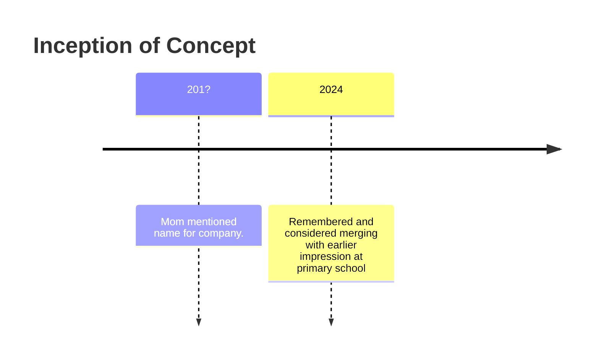

# 木火秋

# Overview

**Basic Information**
English Name: 
Chinese Name: 
Nickname: Short as 木火秋 or just 秋
Funder(s): 
Industry: 
Headquarter Location: 
Symbol: Fiery Maple Leaf

**Organization Details**
Current Owner(s):
Current CEO: 

## Naming and Etymology

Name: 木火“秋”

## Archetype and Inspiration

Archetype: Pending

Inspiration: (2024) We could merge this concept with our high-tech under-dog style 黑道少年公子、黑道少年文化 primary school concept into this, where this gang has some serious high-tech and remove communication technology and this young princess has power. (Pending investigating what kind of social environment nurtures this) (Remark) His father could be one of those early ones who PERSONALLY (without other illegal appraoch) get appraoched or accessed Medalians during "the first contact" and thus gained access to some serious technoloygy - while government bans it. But this gang doesn't really do illegal stuff, it's more like a government-free vigillante.

# Notes

* (Inspiration, 20161202) 老妈说我们以后的家族（姓秋？），那给个什么名字好呢。她提到火啊木的。
* (Description) 一个*边缘组织*（或者就是最大的那个边缘组织？）。组织名称就叫做“秋”，很酷其实。而且Logo也可以设计的很酷——又是一个火红（感觉我这个设计里面很多火红的事物）。(Reference) Teenage Mutant Turtle大脚掌。