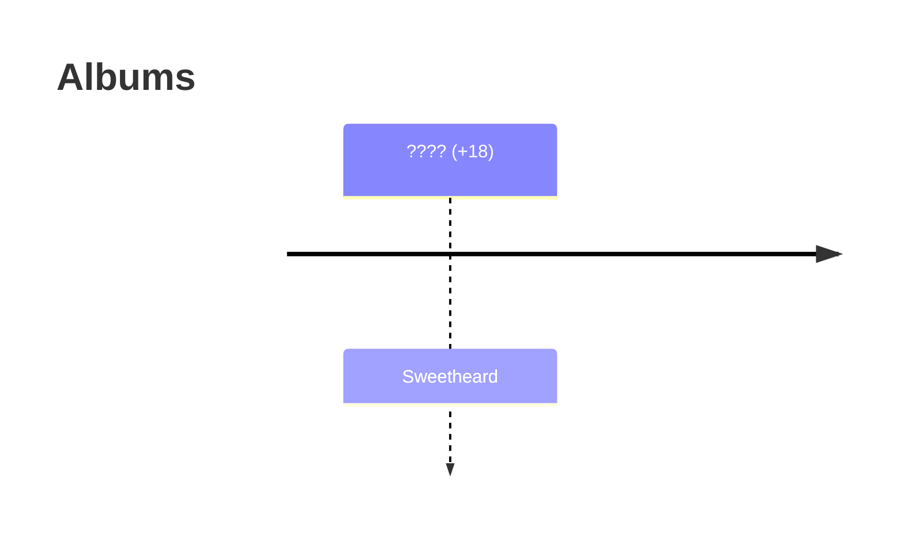

# Eleven Baker 艾丽文·贝可

> Young and cool; Talented as an actor/singer.

Tags: #Favorite, Female, NFC, People, Pop Star, Tellus

As a child star, Eleven was already main character in a dozen TV shows and have cameo appearance in a few movies. The TV shows she participated in were mostly family shows, see section on Childhood for more details. In movies, she always plays this kind of cool cute girls especially in a variety of sci-fi settings - and maybe a few family comedy. Her father was a popular sci-fi novelist.

Eleven has a general interest in sci-fi concepts, higher order constructs, and technology. She's not adequately trained/educated in math or physics though - but she's just interested. That influenced her dressing, her songs, and her styles and themes. Note that sci-fi doesn't mean modernity - Eleven's values and opinions can still be rather conservative - this can be summarized as a "retro" sci-fi style. On the other hand, Eleven likes smart technologies, including smart homes (audio speaker, light, door, phone, car) etc. cool stuff.

Relationships:

* Parents: (Mother) Ellen Baker, (Father) Guomo Shu
* Friends: 萧衎
* Collaborators: (Director) 许鹏
* Lovers (include all who she actually dated; exclude earlier youth times): (Phase 1) N/A; (Phase 2) ...; (Phase 3) 许鹏; (Phase 4) ...; (Phase 5) ???, Xiao Kan.
* Hosts/Owners (on Ids): (Initial Broker) 高士求 (Owner 1) (Owner2) (Owner 3)

* (Remark, #Personal, #20211229) It’s surprising - originally I conceived this character because I was modeling after some stereotypical stupid entertainer-like character, then Xiao Kan was sold to human traffickers and met her. Now after considering all what she might go through, I kind of like her.
* (Remark, #Personal, #20230407) For some reason, the combination of this name, her personality, her suffering through all this and maybe the fact she's a singer (like that one from The Super Dimension Fortress Macross) - she's my favorite now😆 (Maybe after Catherine and Zarna🤔)
* (Remark, #Personal, #20230712) She's definitely one of my favorite.👆

## Names, Naming and Etymology

* Name: Eleven Baker, 贝依依, 艾丽文·贝可, 贝可·艾莉文
* Nickname: Her close friends and family member call her "El/Elv/Lvs/Ivs", which is transalted in Chinese as "十一"。
* Artist Name: Elevyin, Elevyn (idea from, #20230712) Saw musical ads for ELEVIN, the musical artist, on bus. (Comment) Might not use, Eleven sounds good enough.

## Appearance and Impression

(CONSIDER BREAKING IT DOWN OR MERGE WITH ARCHETYPE/PERSONALITY, AND LET APPEARANCE JUST FOCUS ON "APPEARANCE AND FASHION")

(Impression, #20230929) Modern Japanese style cutie. Pony tail

Appearance and Impression: (Notice apperance might change after she's back from the spacetrip - she might have become a warrior on her own)

Due to influence and the variety of shows she participated in, her dressing (notably in those early TV shows and movies) has this retro sci-fi style. Because notice that even in "modern day" after Medalian cultural exchange, the influence of that is fairly limited due to short time span. Eleven has influence from both those "80s" shows and post-Medalian modern culture that her dressing can reflect both retro and post-modern sci-fi style.

* (Impression) Taylor Swift, Margot Robbie (Harley Quinn), that Expose CG painting character (singer) that we had a poster of
* (Appearance) heart-shaped face with a pointed chin, wide cheekbones, and a small forehead. (She might have a heart-shaped face with a pointed chin, wide cheekbones, and a small forehead. Her eyes might be almond-shaped and can be any color, but since you mentioned a European descent, they might be blue or green. She has a small straight nose, and her lips are full and pink. Her body is slender with long legs and arms. She has a defined waistline and has a feminine hourglass figure. ) (Ask ChatGPT to provide more detailed account on her appearance, dressing styles, and wardrobe.)
* 俏皮、可爱、时尚、无可救药的（软弱、任性、固执）、敢想敢拼、幸运、Taylor Swift in my impression

* Fashion: If we just divide fashion into high fashion, pop fashion (only for celebrities) and street fashion. EB (her mother's bran) definitely get involved in the former two (anything targeting luxury), but for the most part, for more 平易近人 style, Eleven't style is Pop fashion, aka. not "high" (maybe very occassionally for pubicity events).

## Production

## Archetype

* Taylor Swift: energetic, adaptable, and inventive. Bright on stage. Lively.
* Avril Lavigne/Madonna: Avril Lavigne is an ISFP personality type. She is sensual and creative, often thinking outside the box. As an ISFP, she has deeply-held values which guide her decisions in life. She loves new experiences and would prefer to jump right in, instead of planning out every single detail. But the key idea is "叛逆".
* Daisy from The Great Gatsby: She is beautiful and charming, but also fickle, shallow, bored, and (latter on Ids) sardonic.
* The singer character from Super Dimension Fortress Macross (Macross F) movie.

## Personality

* Destiny: Her carelessness is what got her into trouble - being sold into another galaxy after partying too high and got drunk. Thankfully as light-hearted as she is the idea of suicide never came to her mind otherwise it’s really hard to go through those hardship (probably because she's spoiled and thinks her life is more valuable than anything). Until she met Xiao Kan and maybe even a bit after that - she's a complete "fucked-up" - to put it lightly. She's very (憎恨的) and reluctant to learn Medalian languages, and she doesn't have any practical skills. There was always hope though - finding then losing the company of Xiao Kan with a blind trust of his promise was the only thing the kept her going. And eventually she came back, a bit older, but much wiser and tougher.

A major character development arc for Eleven Baker goes roughly like this: well nurtured -> famous and spoiled: stupid, naive and weak and relentless -> hopeless and 放浪形骸 -> hope to go back home and help from Xiao Kan brought up her desire to go back -> through training and all stuff going through with Xiao Kan, she changed into a strong, self-independent warrior (not the kind that's super legendary like Hong or Bai, but enough to be a good individual on her own).

Before her 20s:

* Rich like all rich kids: good and bad
* Famous and Spoiled

At her 20s:

* She’s very proud of her name and reputation so even when she’s sold to the outer galaxy she didn’t make up a new name, like how Xiao Kan and others would usually do.

After her 25-30s:

* Strong, mature, and even a bit decisive and assertive

## Education

(Might want to talk about how she joined various competitions/musical events during this period of time, which paves way for her future)

* (College) (CONSULTING TAYLOR SWIFT ETC. EDUCATIONAL BACKGROUND FOR HER MUSICAL TALENTS TO GET NURTURED)

## Career

Eleven Baker is a VERY successful singer. To successfully shape this character as a successful singer, we need to make sure (realistically) *give her a distinct style* - think as an example how 周杰伦 when shown in movies always is that 腼腆 boy who is afraid of his father, or how all his songs are *sort of the same* (pending pin-point what exactly make them the same - could be of technical reasons e.g. chord progression etc.; We might be able to find some technical artistic comments from people analyzing his songs) even though not really sound the same.

Like Jay Chou or Taylor Swift, Eleven Baker writes most of her own songs.

* (#20230815) We may say Eleven is stupid, immature, doesn't have deep knowledge of the world or doesn't understand 人间疾苦 or anything - but she surely is very talented and can produce music and have a good taste of fashion, and can not just enjoy material life but brings joy to her fans.
* (#20230827, idea) Unlike Talor Swift, EB can be an NFC phenomen, and entire theatre can be built just for her so there is complete custom and much more immersive setup (much like Elvis and Las Vegas International Hotel, and we need to consider the stress/freedom aspects of this kind of contract). Though we must consider and recognize having a general purpose stadium and be able to do flexible mobile setup is important for dynamic and quickly changing themes.

## Romance (Theme)

"Good" girls like "bad" boys. Not bad in the sense that poor, sick, or other apparent deficits. They like those boys that are handsome (tall of course), raised poorly in a VERY rich family in a spoiled way, who are very funny, playful, and full of bullshit wisdoms because they are rich and optimistic. I don't know how those kind of relationship ends in reality, but in our theme, it always involves the girl deeply in love, admire the guy so much, and they get together, have some fun, and eventually for big or small things, they just break up. Likely becaus the guy found some new love. The guy, on the other hand, never really value the relationship that much - because it's always easy for them to find attractive girls around them. This is the plot theme that's reflected directly on Eleven's life.

This particular theme we described above applies to all lovers of Eleven before she moved to outside Tellus, we can call it "materialistic". After she moved to Ids, the theme becomes more of a "passive one": she doesn't get to "choose" that much, but she does get to live well and enjoy, while she essentially becomes an asset. This is a "practimatic"/pragmatic? theme. Then eventually, she finds true love (with those two guys).

There are thus generally 5 phases in terms of Eleven's romantic life:

1. Young/Puppy: When Eleven was very young (during primary or secondary school), there were a boy who likes her very much, but unfortunately didn't get her attention and never became a lover. (I am just mentioning it because it's a history) In fact, there might be a lot of boys who like her. But like all young innocent girls, her mind was all in travelling with her parents, or otherwise busy getting to know the world.
2. Adolescence (High school): During adolescent phase, she dated and maybe even fucked a few boys. It's said that for such girls the adolescent loves either hurt the most or was the most fun - the Eleven it was the latter.
3. Mature: For all the material life Eleven enjoys, Eleven enjoys it more with a rich, handsome, and funny guy. Notice Eleven never liked "powerful" people, as in politics - for she thinks those people are disgusting and dishonest and just wants sex. Yet in reality, those rich guys she went out with are "powerful" - just not in a (government) political sense, e.g. some of them might be sons of politically influencial people or heirs of business empires, and latter on when she's sold to the outer galaxy, all she ever has are (rich business/government) political people. As Eleven becomes more materialistic and fancies those rich and in power and thought they would fancy her the same, her love experiece during this stage is mostly hurting herself.
4. Asset: The line between affection, love, romance, and sex becomes blurred at this stage. For a woman becomes an asset, yet she still longs for company, and maybe enjoyment/excitement/romance/surprice/care/sex. So they do things that "lovers" do, but do they really love each other? It's hard to tell. At least not in any sense as simple or as pure as during her first three stages. She's an asset but since she's prestigous and also because Idian people generally values human (or other animal) rights, so this stage is actually the most decent attention and caring for Eleven.
5. Post-Mature: I will give her just two characters at this stage. One is her "affair lover" who's a handsome but not rich (also not deadly poor) but skillful young Medalian man (who works at one of her host's place as an artisan), but latter become dead (killed for some reason). The other is Xiao Kan, who met her, became friends, fell in love, became somewhat obsessed while his own life turns downhill, and eventually comes back and pick her up. At this stage I think the meaning of love has changed significantly: it's not longer about material enjoyment, and more about a combination of lifelong security and deeper commitment - not necessarily a "connection" on the interest level, but something solid.

## Creative Design Goal

(Claimed #20230712) I don't care how you do that or how much trouble this will cause on your study burden etc: we must sample to say the least 10 songs for Eleven.

Goal: We must provide a detailed development of 10 pop songs for Eleven. For now, just title + lyric + a bit production background will suffice. No need to come up with melody.

### The Eleven Baker Style (Branding)

The distinct idol (imaginative figure), (public) personality and musical style is what publisher branding of Eleven Baker all about, and that should be DIFFERENT (but not too much - there must be some kind of internal consistency) from her actual personality. For instance, her weak personality and somewhat unmanagable and 不能自理 personality is hidden from her public figures, which on the other hand is everything but strong and independent - it's simply not mentioned. In fact, a few of her songs can show she's vulnerable but people just didn't get it on the realistic level. As musical style goes, we can again use 周杰伦 as a starting point reference, and apply the same logic to Eleven's songs: (Zhihu) "准确说不是旋律相似，而是和弦走向相似甚至相同。其实和弦走向相同是个流行音乐比较常见的现象，有几个和弦走向比如著名的17654325、4536251、16534145等等不光是周杰伦或者华语乐坛其它音乐人在用。" (also see [十分钟教你做周杰伦式曲风的音乐](https://www.bilibili.com/video/av1146307/)). On the other hand, a more mature development of her musical style is to let the musical style itself has a trend, and a particular evolution of style (which we will work on while we make up her albums) - like more mature type modern western singers like Taylor Swift or Avril Ramona Lavigne.

Outside personal personality, as an artist and singer and public figure, there is a distinctive idol personality that is shaped through media production, agency effort, and Eleven's own creative talents. This personality is very distinct from her actual personality OUTSIDE stage performance and outside the view of camera (aka. herself, when she's with friends, and when she's with family). Such a personality is a result of careful design and we must be careful capturing it, and presenting it in a consistent way. The most direct exposure of such a personality is as shown in the themes of her songs, and in her MVs and in her brand 代言, and in her movies and short films. Note that the things she post on social media are scrutinized by her publishing companies and they do NOT represent her actual personality.

One of the distinct features of her style (which differentiates her from all other singers in the Tellus hemisphere) is the elements of "imagination", "fantasy", and a very cool exotic vibe. She can be considered a "post-war" artist that looks up to the glorious times when Medalians were on Tellus, and asks the question: what would happen, if we did not break up with them, and if we were a true intergalactic civilization now? (And we can combine this with her sci-fi appearance style and retro-sci-fi style and occassional post-modern futuristic sci-fi style)

In general, there is a consistent (topic) theme for her style:

* Space, Outer space: the key is not technical as in geeky but exotic as travelling to space
* Love: like all pop-song and young female singers; For eleven, this is vibrant, passionate, youthful love
* Space Love (especially retro-sci-fi): Love in space, with elements of fiction

From a timespan perspective, her style changes (as an idol personality) as she gets more "mature". Notice Eleven never had a "mature" phase because before she can reach that, she's going outer space for real🥲:

* 出道: Youthful love; Space love.
* 成长: Somewhat more mature and better variety of songs and productions
* 新章程: Full of expectations, hopes (hypes), and excitement, can't wait to fly away

Here we provide a list of her singles, albums, participated TV shows, stage performances/concerts, and movies.

Singles:

* (PENDING MORE)
* (SEE NAMES COLLECTION MD FILE; SEE CANONICAL MINICORE NOTES)
* 冲出地球 Into the Outerspace
* 迷恍星
* 迷恍星 2

Albums:

* (PENDING MORE)
* (SEE NAMES COLLECTION MD FILE; SEE CANONICAL MINICORE NOTES)
* Addicted

## Birth

Eleven was born just a little bit BEFORE Medalian contact in (Vancouver; Former NFC). His father left the family at her age of 7. Eleven's grandmother lived with them during her childhood and they had a good relationship - even after her father left.

* (#20230815) Notice we want Eleven to be born BEFORE medalian contact for two reasons: 1) So she can attend those "80s" TV show, 2) So she has plenty of exposure of retro-sci-fi.
* (#20230815) Just in case we finally can't work out the timeline and Eleven was born AFETER Medalian contact, then we might still be able to keep those retro-style (though arguably that will be 小众) aesthetics, but she will definitely lose the history of participating in those "80s" TV shows.
* (#20230815) Notice we want Guomo Shu to leave Eleven aroud 7 so she has a bit better memory of her father. Ideally he leave at around age 10 so the bond is solid. However, leaving at age 10 is a bit unrealistic unless for VERY special reasons - Medalian contact and extra romantic affair would be a solid one.

## Childhood

Eleven's grandmother lived with her family when she's young, even after her father left. Eleven's grandfather died before Eleven was born. Eleven's grandmother died 7 years after Guomo Shu left the family, at Elevens' age of about 14 or 17.

## High School

Eleven attended her high school at a private school in (Vancouver; Former NFC)

Best female friends during high school (two caucasian, one "asian", one "indian"): ????, ???, ???, ???.

* (#20230815) One of her caucasian female friend was a model during university time, and latter become an not-so-famous actress in some TV shows.
* (#20230815) The "indian" girl had some rich family.

## Brief of Life Path -> Full Life Path Timeline

(CONSIDER BREAKING IT DOWN INTO SCHOOLING ETC. ALL OTHER SPECTS FOR ELABORATED DISCUSSIONS AND INFORMATION; AS OVERALL "LIFEPATH/TIMELINE" GOES, WE CAN JUST PROVIDE AS A PLAIN LIST BULLET POINT SUMMARY CONTAINING ONLY THE NAMES AND TIME OF THINGS/LOCATIONS)

* Young and talented nurtured by her mom
* Father and mom had a diverce at her teenage - this had impact on her personality and insecurity in romantic relationships and abusive behavior in drug and sex and parties
* Photos of potential drug abuse and nudity leaked online
* Leaving NFC for a development at outer galaxy (potentially a fraud set up by agents hunting for such people at trouble)

(BELOW SPECIFIC EVENTS PENDING TIME STAMPS)

* Eleven Baker hosted event for publishing the last new album she would have on Tellus
* Eleven Baker left Tellus for space station and re-opening of gateway

* (#20230815) Notice both Taylor Swift and Avril Ramona Lavigne did NOT attend college. In fact, Taylor had her first tour around 14 and Avril definitely had her album at around 17. In that case the first (production quality with the assistance of a real publishing company) album of Eleven cannot come latter than the age of 15.

## ~~College/University~~

WE MUST MAKE IT CLEAR THAT A TALENTED FIGURE LIKE HER DOESN'T NEED TO GO TO COLLEGE. JUST LIKE TAYLOR SWIFT.

* (20230815) Notice Ellen might insist Taylor complete some college studies? She may have spent two years in college before dropping out on her own.

## Successful Career at NFC

* (#20230815) Eleven WAS ORIGINALLY NOT BORN IN NFC, but her mother was successful, and after divorce with her father, Ellen moved them to NFC, so Eleven kind of grow up at this place. When she grows older, she naturally starts her career right here. Although it might make sense for she to spend a few years abroad, to study and gain exposure to other more established industries and places, for NFC was relatively new and other places may have better established entertainment industries (in fact, she could do it at college/university), before moving back, for NFC is definitely the best in the long run.

## Leaving NFC

<!--What immediately happens afterwards?-->

## Owners

Throughout her time on Ids or within Medalian system, she had 4/5 owners in succession.

Original dealer: 高士求
First intermediate agency: 魅途星际
First owner: (A decent and new-wealth guy who latter became bankrupt)
Second owner: (Female, mean) - worst treatment ever. She ashames her, somewhat abuses her (mostly mentally), starve her a bit, though very little direct/obvious physical damage (for she still needs to sell her).
Scond-to-last Owner: (Politically influential figure)
Last owner: (Successful business man)

## Before Settling Down (Second-to-Last Owner)

Her last owner was ???. He's a very rich guy living at the top hill in the corner near a gigantic city while distant from everyone else.

She had an affair with an artisan working there during this period of time.

After the owner was down and the artisan was dead, she's once again sold to another person.

* (#20230815) If something's going to happen to her owner, then it must be something big, for someone as rich as him doesn't seem like would be easily put down.

## Last Owner

(PENDING)