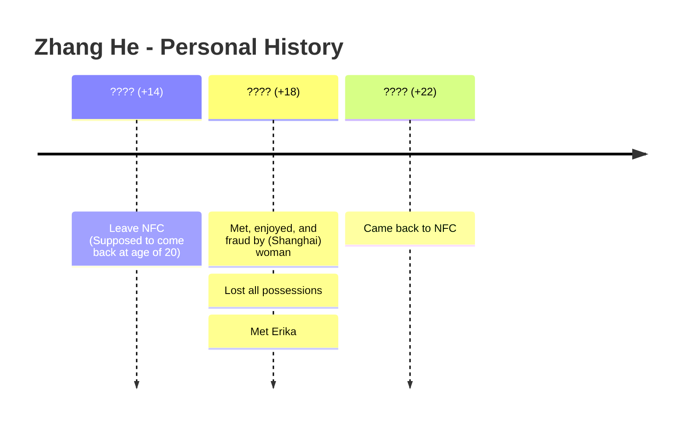

# Zhang He 张鹤

Tags: People, Medala, Myah

Names: Zhang He, 张鹤

Native name **Fulai Osawa** (风一般的男子), conceived in 2003 <!--This date should be rather fixed since that's when Kun was around on Earth-->, embyo frozen in Medala lab awaiting further instruction, then 6 years after Kun left/die (2013) or 3 years after CofN's early construction (mostly the arrangement for Undercity) after the 2007 final battle, Mr. Leng developed the embryo with the help of 张嫂 and Zhang He was born on Earth (somewhere near Vancouver) in *early 2014* , kept for 6 months then given to Zhang household under an arrangement, and have lived with Zhang household until *2020* (age 7) <!--This data was rather fixed because that's still the very early stages of CofN development, the 2012-2035 period--> when Mr. Leng brought the Zhang household into **The Courtyard of Turtle Tiled Glass** to live together as a servant family. Since Zhang He was born INSIDE CofN, he owns a full cityzenship of the City, while Zhang family came before CofN and lived under the special arrangement (or they could get a full cityzenship as well) of **Special Consideration for The Aboriginal Populations of Vancouver** (Legal adult age was using the outside measure as 18 years old). 

Ever since living with Leng family in 2020, Zhang He and Catherine had major influence to each other.

Left the city at the age of 14 in 2027, came back in 2043 (age 29), travelling a total of 16 years (that is a lifetime's worth of duration!).

## Naming and Etymology

From impression of him with Catherine. Just felt "张鹤" would be a suitable name for him.

## Medical Situation

Zhang He used to meet 祝西城 for his examination of some brain/mental/muscle issues - and Zhu got some of his blood for studies.

He doesn't understand what's going on in his body (14). Teachers/doctor say it's just somewhat unusual 分泌of some 激素, but all is good. Sometimes he feels distinct/separated....

## Timeline of Events

* ~~萧衎和张鹤开始陷入关于Catherine更喜欢谁的问题~~ (Remark, #20230407) No longer applicable. Catherine never had feeling for Xiao Kan. (Comment, #20231018) Could still trouble Zhang He a bit?